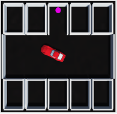
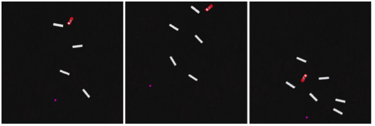

# Deep Reinforcement Learning for Low-Speed Maneuvers

This project explores path following using Deep Reinforcement Learning in two distinct contexts. The first context involves navigating a vehicle through tight and narrow spaces, making it suitable for urban environments, parking lots, or any scenario requiring precise maneuvering. The second context presents a larger area with obstacles randomly positioned between the start and end points, simulating scenarios like cluttered warehouses, dynamic construction sites, or obstacle-filled terrains.



The `Garage` simulation environment.



Three examples of the `RandomObstacles` scenario.

## Prerequisites:

* Unity: >= 2020.3.22f1 (tested on 2021.3.2f1)
* Python: >= 3.8.10
* ML-Agents: >= 0.25.1 (tested on 0.29.0)
* ML-Agents Unity package version: 2.0.0
* Anaconda or Miniconda

To install all the requirements, it should be sufficient to use the command:

```bash
pip install mlagents
```
or, in case you have some incompatibility issues, a conda environment config is available:
```bash
conda install -f unity.yml
```

## Configuration
- You can choose between the two use-cases by selecting the scenes present into the `Assets/Scenes` folder. The `Garage` folder contains the scenes related to the narrow spaces maneuvering scenario, while the `RandomObstacles` folder the navigation through the larger area with random obstacles.
- Specific parameters can be tuned from the `AgentPrefab` GameObject inspector:
  - Adjust observation settings.
  - Select the model for inference.
  - Set behavior type (inference, heuristic, default).
  - Define the training decision period.
  - You can also modify the existing lidar sensor or add new sensors under the `Sensors` GameObject.
  - All the network parameters are located into a `config.yaml` file inside the `config` folder (`Garage.yaml` and `RandomObstacles.yaml`).

- For each use-case, locate a `CheckScene` for inference and a `TrainingScene` for training a new model.

- Fine-tune rewards:
  - For the random obstacles case, adjust parameters in the `GeneralizationAgent` script.
  - For the garage example, modify settings in the `PathFollowingAgent` script.

## How to open the project in Unity?

After cloning or downloading the repository, follow these steps to open the project and work on it:

1. Open the Unity Hub.
2. Select "Open Project" and navigate to the folder where the project is saved.
3. Open the project by selecting its main folder.

Remember, a Unity project is a collection of files and directories, so be sure to select the main project folder.

Once the project is open, install the ML-Agents package version 2.0.0 from the Window/Package Manager in the Unity editor.

## Training 

Training can be performed in the Unity editor or in a built project. 
1. Set the `isTraining` variable under `GarageEnvironment --> ConfigurationManager` from the Unity inspector.
2. Set behavior type to _default_ from the `AgentPrefab` GameObject inspector.

3. To train from inside the editor, use the following command:

    ```bash
    mlagents-learn config/trainer_config.yaml --run-id=name
    ```
    Otherwise, to train using a built project:
  
    ```bash
    mlagents-learn config/trainer_config.yaml --run-id=name --env=path/to/built/project
    ```
    Here is a list of `mlagents-learn` arguments that can be useful to speed-up or improve training:
    - `--run-id`: Sets a run name.
    - `--env`: environment or executable name.
    - `--resume`: Continues a previous training session.
    - `--num-envs`: Controls the number of concurrent Unity instances that are executed in parallel during training, allowing to speed up training (this is very dependent on your hardware specifics).
    - `--force`: Overwrites an existing training session.
    - `--inference`: Starts a session in inference mode.
    - `--no-graphics`: Does not render the scene.

4. A Tensorboard session will be automatically created. You can follow the training evolution by launching Tensorboard on a separate command line window:
    ```bash
    tensorboard --logdir results
    ```

## Inference
Inference can be performed in the Unity editor or in a built project. 

- In order to perform it on a built project, simply launch:
  ```bash
  mlagents-learn config/trainer_config.yaml --run-id=name --env=path/to/built/project --resume --inference
  ``` 
- To launch it from inside the Unity editor:
  1. Open the `CheckScene` scene.
  2. Unset the `isTraining` variable under `GarageEnvironment --> ConfigurationManager` from the Unity inspector.
  3. Set behavior type to _inference_ from the `AgentPrefab` GameObject inspector and select a NN Model (two pre-trained models, one per use-case are already available inside `Assets/NNModels`).
  4. Set the `maxIteration` value under `GarageEnvironment --> ConfigurationManager` according to the number of episodes you want to perform inference on.
  5. Wait until the end of the run, the success rate will be printed on the console.

## Citing
Consider citing our work related to the low-speed maneuvers and car parking topic.
- [Deep Reinforcement Learning for Automated Car Parking](https://link.springer.com/chapter/10.1007/978-3-031-30333-3_16)

## Comparison against Hybrid-A-Star
The two scenarios presented have been compared with the popular Hybrid-A-Star heuristic path planning algorithm. More detais are visible [here](https://github.com/Elios-Lab/Hybrid-A-Star).

## Useful links:

- [Unity](https://unity.com/download)
- [Unity documentation](https://docs.unity3d.com/Manual/index.html)
- [ML-Agents](https://github.com/Unity-Technologies/ml-agents)
- [ML-Agents Overview](https://github.com/Unity-Technologies/ml-agents/blob/main/docs/ML-Agents-Overview.md)
- The 3D car models used in this project come from Sketchfab:
  [Chevrolet Corvette 1980 Different colours](https://sketchfab.com/3d-models/chevrolet-corvette-1980-different-colours-7e428bdb3ab54b4e9ac610e545fd9d03)
- [Baseline code](https://medium.com/xrpractices/autonomous-car-parking-using-ml-agents-d780a366fe46)
- [Hybrid-A-Star on the same contexts](https://github.com/Elios-Lab/Hybrid-A-Star)
--- 
<!--
# Pathfollowing with Deep Reinforcement Learning

## Prerequisites:

* Unity: >= 2020.3.22f1 (tested on 2021.3.2f1)
* Python: >= 3.8.10
* ML-Agents: >= 0.25.1 (tested on 0.29.0)
* ML-Agents Unity package version: 2.0.0
* Anaconda or Miniconda

To install all the requirements use the command:

```pip install mlagents```

or, alternatively:

```conda install -f unity.yml```

## Useful links:

* [Unity](https://unity.com/download)
* [Unity documentation](https://docs.unity3d.com/Manual/index.html)
* [ML-Agents](https://github.com/Unity-Technologies/ml-agents)

The cars 3D models used in this project come from Sketchfab:

* [Chevrolet Corvette 1980 Different colours](https://sketchfab.com/3d-models/chevrolet-corvette-1980-different-colours-7e428bdb3ab54b4e9ac610e545fd9d03)

# How to open the project in Unity?

After cloning or downloading the repository, you have to follow these simple steps to open the project and work on it:

1. Open the Unity Hub 
2. Open an existing project
3. Select the folder in which the project has been saved and open it

Note that a Unity project is a collection of files and directories, rather than just one specific Unity Project file. To open a Project, you must select the main Project folder, rather than a specific file.

After opening the project you need to install the ML-Agents package vers. 2.0.0 from Window/Package Manager in unity editor.

# ML-Agents setup

## Installation

* [Installation](https://github.com/Unity-Technologies/ml-agents/blob/main/docs/Installation.md)

## Documentation

For further information it is better to consult the official documentation:
* [Documentation](https://github.com/Unity-Technologies/ml-agents/blob/main/docs/Readme.md) 

Here is a detailed description of all the features [ML-Agents Overview](https://github.com/Unity-Technologies/ml-agents/blob/main/docs/ML-Agents-Overview.md). 


## Training 
Training can be performed in the Unity editor or in a built project.
To train inside the editor use the following command:

```mlagents-learn config/trainer_config.yaml --run-id=name```

 Otherwise, to train using a built project:

 ```mlagents-learn config/trainer_config.yaml --run-id=name --env=path/to/built/project```

Note that if a run id is already present, training will not start. To overwrite an existing run id add ```--force``` to the above command.
For more informations and features:
* [Training Documentation](https://github.com/Unity-Technologies/ml-agents/blob/main/docs/Training-ML-Agents.md)
-->
